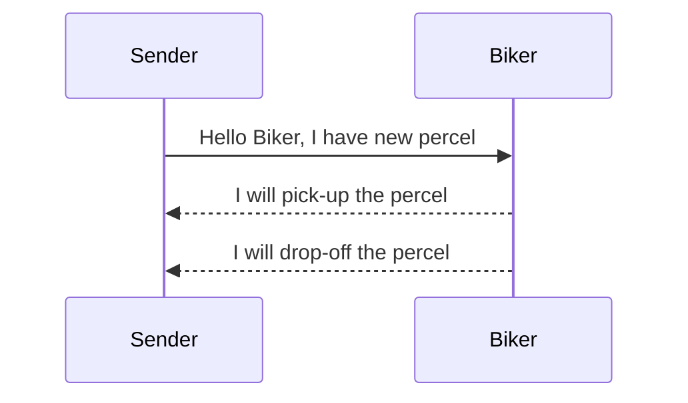

# Welcome to Saloodo Task!

Hi! 

Task PHP Developer: A private delivery service company in Cologne handles the collection and delivery of parcels for people.

**This is done by bikers.**
The problems to be addressed are:

-   A sender should be able to create a parcel to be delivered by specifying pick-up and drop-off address (should be just a text field, no need for address validation)

-   A sender should be able to see the status of his parcels.
    
-   A biker should be able to see a list of the parcels.
    
-   A biker should be able to pick up a parcel.
    
-   Once a parcel is picked up by a biker, it cannot be picked up by other bikers.
    
-   A biker should be able to input the timestamp of the pickup and the delivery for each order.
    
-   The status of the order should be updated for the sender.

# Install

	- Clone project xxxxx
	- Composer install
	- cp .env.example .env
	- php artisan key:generate
	- add mysql connection
	- php artisan migrate --seed
	- npm install (brew install npm)(in mac)
	- npm run dev

## Run Server

- Valet (brew install valet)(in mac)
	- in folder of project 
		- valet link
		- valet park
		- valet secure
- Localhost 
	- php artisan server

- Docker
	- sail up 

## Testing

	- php artisan test 

> **Note:** if you need any help i Always support.

## What Can Do

SmartyPants converts ASCII punctuation characters into "smart" typographic punctuation HTML entities. For example:

|ٌ Sender                   | Biker                         
|----------------|-------------------------------|-
|Can list parcels            |Can list parcels           |
|Can Create parcel        |Can pickup parcel         |
||Can Drop off parcel|

## UML diagrams

You can render UML diagrams using [Mermaid](https://mermaidjs.github.io/). For example, this will produce a sequence diagram:

## About Code

    
